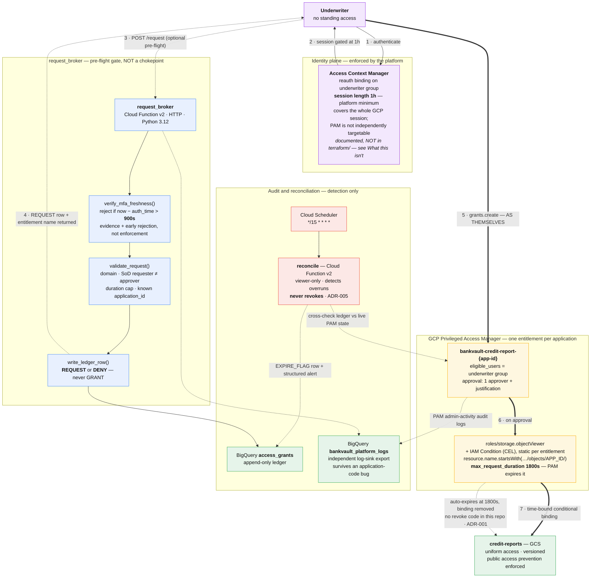

# BankVault

Just-in-time privilege elevation for a mock mortgage lender's loan-origination pipeline. No underwriter holds standing access to borrower credit reports. Each approved request yields a time-bound grant scoped to one application's prefix, gated on a fresh multi-factor login, issued through Google Cloud **Privileged Access Manager (PAM)**, and recorded in an append-only BigQuery ledger.

> **Status:** reference architecture. This repo is Terraform + Python + docs, verified with `terraform validate` and `pytest`. It is not a deployed GCP project. See [What this isn't](#what-this-isnt).

## The problem it solves

Ask a lender who can read a borrower's credit file today and you usually get a list of roles, not a list of people. Standing access is the default almost everywhere, and it survives quarterly review cycles that were never designed to catch a reassignment made in week two. For up to a quarter, a transferred or terminated underwriter can keep read access to income documentation, SSNs, and full credit reports with nobody actively deciding they should have it *today*. That is a GLBA Safeguards Rule access-control gap (16 CFR 314.4(c)(1)) and a PCI DSS v4.0 Requirement 7 finding waiting for an audit.

BankVault removes the standing grant. An underwriter who needs a credit report asks for it, proves the login is fresh, gets 30 minutes scoped to that one object, and loses it automatically when PAM expires the grant. Nobody holds a key while they are not using it, and the whole exchange is a row in a ledger before access is live.

## Architecture

**Solid lines are enforcement. Dashed lines are advisory or detection.** The distinction matters here: the privilege path does not run through this repo's code. PAM grants privileges to the calling principal, so the underwriter requests their own grant, and the broker sits beside that path rather than in front of it ([ADR-006](docs/adr/006-who-requests-the-grant.md)).



Read edge 5 carefully — it is the whole point. The underwriter calls PAM directly, because PAM elevates the caller and there is no on-behalf-of parameter. A broker in that path would elevate its own service account and create exactly the standing access this project removes.

**Two freshness numbers, and only one of them is enforcement.** ACM enforces a one-hour session bound, which is the platform floor. The broker rejects anything staler than fifteen minutes and records the gating `auth_time` in the ledger. So the evidence is tighter than the enforcement, and an underwriter who skips the broker still faces the one-hour bound. Claiming fifteen-minute enforcement would be claiming a control that does not exist.

Full field-level walkthrough: [`docs/architecture.md`](docs/architecture.md).

## What changed from the first cut (and why the code is smaller)

The code is smaller than it was because the project reversed itself twice. Both reversals are recorded, and in both cases the trigger was written down before it fired.

**Reversal 1 — build vs. buy ([ADR-001](docs/adr/001-build-vs-buy-jit-broker.md)).** The first version was a custom broker: one function applied a conditional IAM binding, a second ran on a schedule to strip it. ADR-001 named the exact condition that would make that wrong: *Google ships a managed grant lifecycle that does this natively.* That condition fired. PAM reached GA with time-bound grants, an approval workflow, and IAM-Condition support on the granted role. The custom `revoke_access` function existed only to undo something PAM now undoes itself, so it was deleted rather than defended.

**Reversal 2 — who requests the grant ([ADR-006](docs/adr/006-who-requests-the-grant.md)).** What survived Reversal 1 was a broker that verified login freshness and then called `grants.create` on the underwriter's behalf. That seam carried a note saying the grantee semantics had to be verified before deploy. Verifying it killed the design: PAM attaches a grant's privileges to the **calling principal**, and `CreateGrant` has no grantee or on-behalf-of parameter. A broker-mediated grant would have elevated the broker's own service account — an always-on, never-reviewed identity holding read access to borrower credit reports. That is worse than the standing access the project exists to remove, because a transferred underwriter at least shows up in a quarterly review and a service account does not.

So the broker stopped creating grants. The underwriter requests their own, and the broker kept the two jobs it can actually do: rejecting bad requests before they reach PAM, and recording the `auth_time` that gated each one. Enforcement of login recency moved to an Access Context Manager reauth binding, where it costs precision — one hour enforced instead of fifteen minutes claimed.

Neither reversal is an embarrassment in the project. They are the project. A design that has never been falsified by contact with a platform's actual semantics has usually not been checked against them.

## Repository layout

```
bankvault/
├── terraform/
│   ├── main.tf                    # providers, enabled APIs, common labels
│   ├── variables.tf               # every knob: durations, names, groups, max auth age
│   ├── storage.tf                 # credit-report bucket (uniform, versioned, PAP enforced)
│   ├── pam.tf                     # the PAM entitlement, IAM Condition, approval workflow
│   ├── iam.tf                     # broker + reconcile service accounts, least-privilege roles
│   ├── bigquery.tf                # append-only audit ledger + platform-log dataset
│   ├── functions.tf               # both Cloud Functions v2, zipped from functions/
│   ├── scheduler.tf               # Pub/Sub topic + Cloud Scheduler reconcile sweep
│   ├── logging.tf                 # log sink → BigQuery for PAM + function audit logs
│   ├── outputs.tf
│   └── terraform.tfvars.example
├── functions/
│   ├── request_broker/main.py     # MFA-freshness gate + validation + ledger write (no grant creation, ADR-006)
│   └── reconcile/main.py          # detect-only overrun sweep
├── tests/                         # pytest, all GCP + IdP clients mocked, no network
├── scripts/run-local.sh           # serve either function via functions-framework
├── docs/
│   ├── index.md
│   ├── architecture.md
│   ├── controls-mapping.md        # GLBA / PCI DSS v4.0 / SOX 404 / FFIEC → specific resources
│   └── adr/001..006
└── mkdocs.yml
```

## Setup

### 1. Configure Terraform
```bash
cd terraform
cp terraform.tfvars.example terraform.tfvars
# Edit terraform.tfvars: set project_id, underwriter_group, approver_group
```

### 2. Validate (no GCP credentials needed for this)
```bash
terraform init -backend=false
terraform fmt -check -recursive
terraform validate
```

### 3. Plan and apply against your own project (needs credentials and a provider that ships the PAM resource)
```bash
terraform init
terraform plan  -var-file=terraform.tfvars
terraform apply -var-file=terraform.tfvars
```

> The `google_privileged_access_manager_entitlement` resource requires a recent `hashicorp/google` provider. Pin and verify the version before you apply. See [`terraform/pam.tf`](terraform/pam.tf) for the version note.

### 4. Run the tests
```bash
python -m venv .venv
source .venv/Scripts/activate       # .venv/bin/activate on macOS/Linux
pip install -r tests/requirements-test.txt
pytest tests/ -v
```

### 5. Try the broker locally (boots without real GCP)
```bash
scripts/run-local.sh broker
# A stale-login request is rejected by verify_mfa_freshness before any PAM call:
curl -s localhost:8080 -H "Content-Type: application/json" -d '{
  "requested_by":"underwriter@lender.example.com",
  "approved_by":"lead@lender.example.com",
  "application_id":"APP-1001",
  "justification":"manual QC review",
  "auth_time": 0
}' | python -m json.tool
```

## Compliance coverage

Full citations and resource-level mapping: [`docs/controls-mapping.md`](docs/controls-mapping.md).

| Framework | Covered by |
|---|---|
| GLBA Safeguards Rule (16 CFR 314.4(c)(1)) | No standing access to customer financial data; per-request, per-object grants |
| PCI DSS v4.0 Req. 7 (least privilege / need-to-know) | Object-scoped + time-bound IAM Condition, max-duration cap, approval workflow |
| SOX 404 ITGC (logical access, change management) | Append-only BigQuery ledger, Terraform-reviewed entitlement, PAM-owned expiry |
| FFIEC IT Handbook (Information Security, Access Control) | Single identity source (ADR-002), segregation of duties, dual-layer logging |

## Honest limits

Four claims in this repo are narrower than they look, and all four are stated on purpose.

**The broker is not a chokepoint.** It is a pre-flight gate you can skip. The underwriter must be the eligible principal on the PAM entitlement, so the PAM request path is open to them by construction. A control that is bypassed by not calling it is not enforcement, and this repo does not describe it as one (ADR-006).

**Enforced login recency is one hour, not fifteen minutes.** Access Context Manager's `--session-length` accepts `0s` or 1h–24h and nothing between, so one hour is the platform floor rather than a design choice. The fifteen-minute broker check is early rejection and ledger evidence. It also costs more than it looks: because PAM is not independently targetable by a `scopedAccessSettings` binding, the reauth requirement lands on the underwriter group's entire Google Cloud session, not just credit-report requests. Everyone in that group reauthenticates hourly for everything.

**Availability is bounded by the identity provider.** The broker denies access when the IdP is unreachable, because it cannot confirm the login is fresh. A loan decision with an SLA does not stop having one because the IdP is down. That trade is deliberate: an identity control that keeps granting when it cannot verify who is asking has a bypass, and the bypass opens under exactly the conditions an attacker wants. (ADR-004.)

**Reconciliation detects an overrun. It does not contain one.** The honest sentence is "detected within roughly one reconcile interval," not "contained within." PAM owns the actual expiry; the reconcile job is a completeness and anomaly check, not a second enforcement path. (ADR-005.)

## What this isn't

- **Not a real lender.** No core system, no real borrower data, no real underwriting workflow. It is a portfolio-grade demonstration of the JIT-access pattern on a plausible lending use case.
- **Not wired to a real IdP.** Workforce Identity Federation is the documented identity plane (ADR-002), but no live SAML/OIDC provider is connected. `verify_mfa_freshness` validates a token's claims shape and `auth_time`; it does not perform full signature verification against a live JWKS endpoint in this repo.
- **The ACM reauth binding is documented, not provisioned.** The architecture diagram draws it as the enforcement layer because that is where enforcement belongs after ADR-006, but there is no `google_access_context_manager_*` resource in `terraform/`. It is an organization-level control that needs an access policy this project does not own. Until it is applied, the enforced-recency claim is a design position, not a deployed control — and the broker's 900s check is the only freshness logic actually present in this repo.
- **Not deployed.** Verified with `fmt` / `validate` / `pytest`. `terraform apply` is left to whoever has credentials.
- **Not production-hardened.** No VPC Service Controls, no CMEK by default, no DLP content inspection, no alerting pipeline beyond the structured log the reconcile job emits. These are reasonable next steps, listed in [`docs/architecture.md`](docs/architecture.md), not gaps hidden under the demo.
